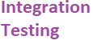
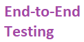
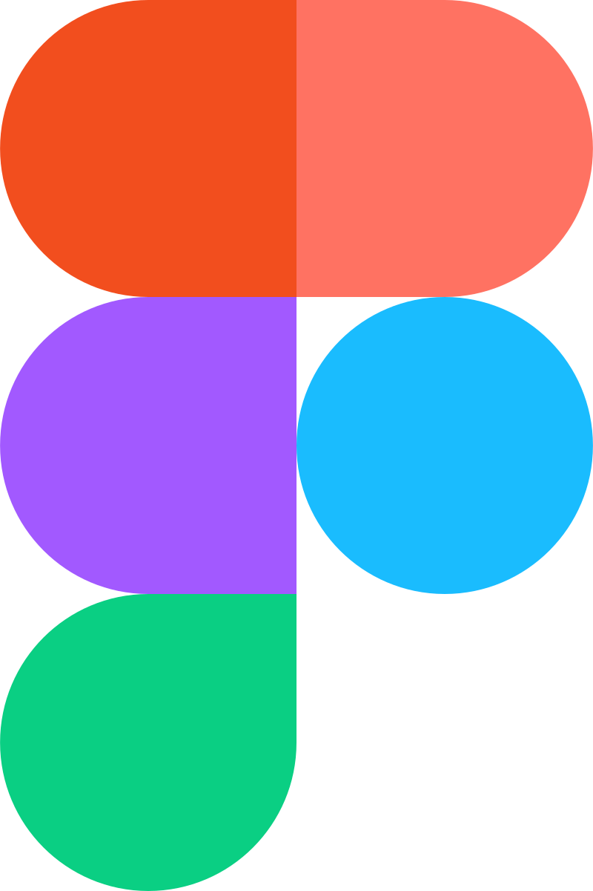

- 👋 Hi, I’m **Andrei Costache**
- 👀 I’m interested in **Swimming, Cooking and a lot more!**
- 🌱 I’m currently learning **Angular** **React** **AWS**
- 💞️ I’m looking to collaborate on **Anything!**
- 📫 How to reach me: **costacheandrei43@gmail.com**

<a href="https://www.linkedin.com/in/stelian-andrei-costache/" target="_blank" rel="noreferrer">  

<h3 align="left">Technical principles:</h3>

<a href="https://en.wikipedia.org/wiki/Object-oriented_programming" target="_blank" rel="noreferrer">  
<a href="https://en.wikipedia.org/wiki/SOLID" target="_blank" rel="noreferrer">  
<a href="https://en.wikipedia.org/wiki/Representational_state_transfer" target="_blank" rel="noreferrer">  
<a href="https://en.wikipedia.org/wiki/Web_API" target="_blank" rel="noreferrer">  
<a href="https://en.wikipedia.org/wiki/Unit_testing" target="_blank" rel="noreferrer">  
<a href="https://en.wikipedia.org/wiki/Integration_testing" target="_blank" rel="noreferrer">  
<a href="https://www.techopedia.com/definition/7035/end-to-end-test" target="_blank" rel="noreferrer">  
<a href="https://en.wikipedia.org/wiki/Mock_object" target="_blank" rel="noreferrer">  
<a href="https://en.wikipedia.org/wiki/Test-driven_development" target="_blank" rel="noreferrer">  
<a href="https://en.wikipedia.org/wiki/Behavior-driven_development" target="_blank" rel="noreferrer">  
<a href="https://martinfowler.com/bliki/CQRS.html" target="_blank" rel="noreferrer">  
<a href="https://en.wikipedia.org/wiki/Mediator_pattern" target="_blank" rel="noreferrer">  

<h3 align="left">Languages and Tools:</h3>

<a href="https://en.wikipedia.org/wiki/.NET" target="_blank" rel="noreferrer">  
<a href="https://en.wikipedia.org/wiki/C%2B%2B" target="_blank" rel="noreferrer">  
<a href="https://en.wikipedia.org/wiki/Java_(programming_language)" target="_blank" rel="noreferrer">  
<a href="https://en.wikipedia.org/wiki/Swift_(programming_language)" target="_blank" rel="noreferrer">  
<a href="https://en.wikipedia.org/wiki/Git" target="_blank" rel="noreferrer">  
<a href="https://en.wikipedia.org/wiki/Android_(operating_system)" target="_blank" rel="noreferrer">  
<a href="https://en.wikipedia.org/wiki/Docker_(software)" target="_blank" rel="noreferrer">  
<a href="https://en.wikipedia.org/wiki/Entity_Framework" target="_blank" rel="noreferrer">  
<a href="https://en.wikipedia.org/wiki/Postman_(software)" target="_blank" rel="noreferrer">  
<a href="https://en.wikipedia.org/wiki/Swagger_(software)" target="_blank" rel="noreferrer">  
<a href="hhttps://en.wikipedia.org/wiki/OAuth" target="_blank" rel="noreferrer">  
<a href="https://en.wikipedia.org/wiki/Figma_(software)" target="_blank" rel="noreferrer">  
<a href="https://wixtoolset.org/" target="_blank" rel="noreferrer">  

